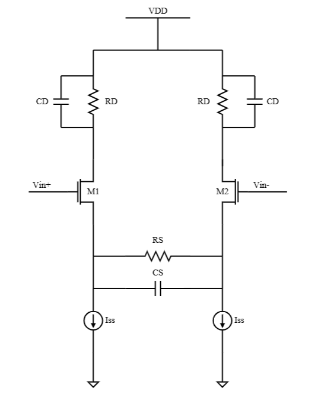
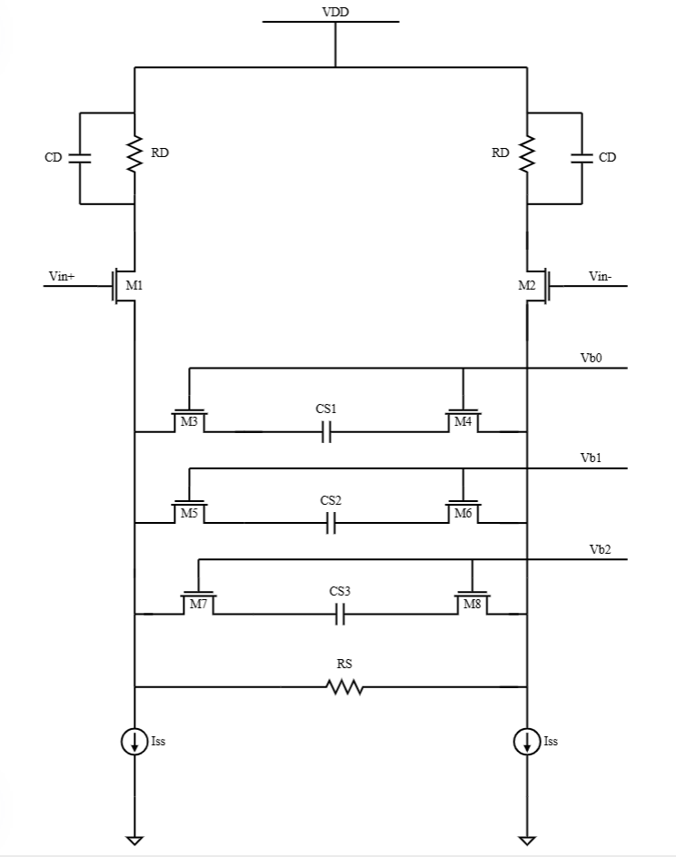
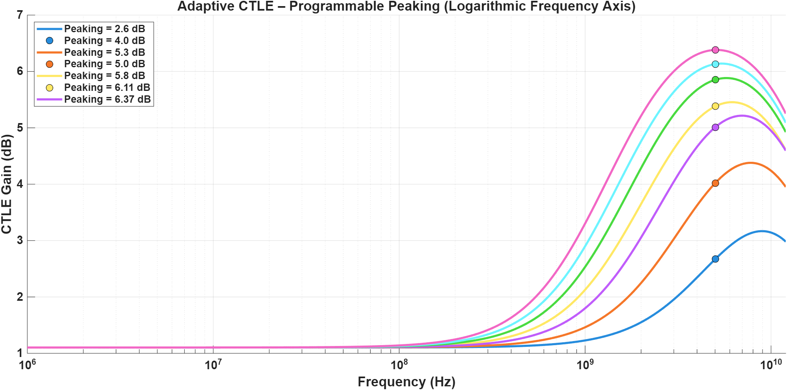
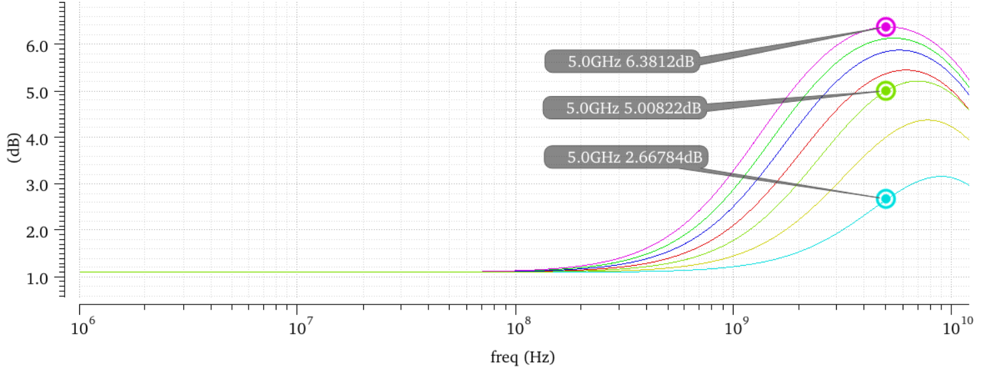
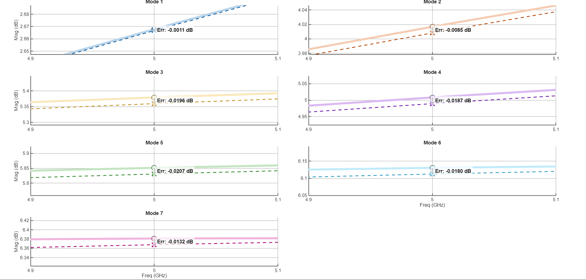
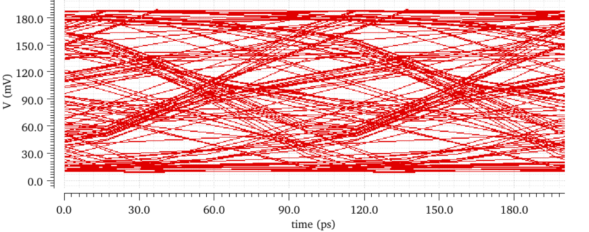
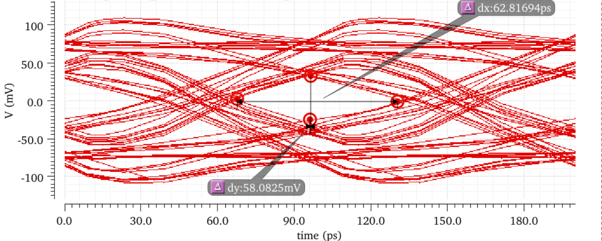

# Adaptive CTLE with 3-Tap FFE for 10 Gb/s NRZ Serial Links

This project presents a low-power adaptive Continuous-Time Linear Equalizer (CTLE) combined with a 3-tap Feed-Forward Equalizer (FFE) for high-speed serial link equalization.

The system targets a 10 Gb/s NRZ link over an FR-4 channel with approximately 8 dB insertion loss at the 5 GHz Nyquist frequency. The transmitter-side FFE reduces deterministic ISI using pre-distortion, while the receiver-side adaptive CTLE compensates for high-frequency channel loss.

## Presentation

[View / Download the project presentation](presentation/Design-of-Equalizers-for-High-speed-Serial-Links.pdf)

## Project Overview

High-speed serial links suffer from frequency-dependent channel loss, which attenuates high-frequency components and causes inter-symbol interference (ISI). This results in eye closure at the receiver.

To improve signal integrity, this project uses:

- A transmitter-side 3-tap FFE
- A receiver-side adaptive CTLE
- A 3-bit programmable capacitor bank for peaking control
- MATLAB-based reconstruction and verification of Spectre AC responses

## Adaptive CTLE Architecture

### Conventional CTLE



### Proposed Adaptive CTLE



The CTLE is based on a source-degenerated differential pair. A programmable capacitor bank is added in the degeneration path to control the zero location and tune the amount of high-frequency peaking.

The adaptive CTLE supports 7 peaking modes.

## Key Results

| Parameter | Value |
|---|---|
| Data Rate | 10 Gb/s NRZ |
| Nyquist Frequency | 5 GHz |
| Channel Loss at 5 GHz | ~8 dB |
| CTLE Peaking Range | 2.6 dB to 6.37 dB |
| Supply Voltage | 1.2 V |
| CTLE Power Consumption | 0.78 mW |
| Energy Efficiency | 0.078 pJ/bit |
| FoM | 0.012 pJ/bit/dB |
| MATLAB-Spectre Error at 5 GHz | < 0.021 dB |

## Results Summary

The unequalized channel shows severe eye closure due to insertion loss and ISI. With equalization, the eye opening improves significantly.

The CTLE provides programmable high-frequency boosting, while the FFE performs transmitter-side pre-distortion to reduce time-domain ISI.

### Programmable Peaking Response



### Spectre Peaking Results



### MATLAB-Spectre Error Near 5 GHz



### Channel Eye Diagram



### Equalized Eye Diagram



## Repository Contents

```text
Design-of-Adaptive-CTLE-for-10gbps-serdes/
├── images/
│   ├── adaptive_ctle_schematic.png
│   ├── conventional_ctle_schematic.png
│   ├── all_peakings.png
│   ├── cadence_peakings.png
│   ├── error_5GHz.png
│   ├── channel_eye_diagram.png
│   └── ffe+channel_eye_diagram.png
├── presentation/
│   └── Design-of-Equalizers-for-High-speed-Serial-Links.pdf
└── README.md
